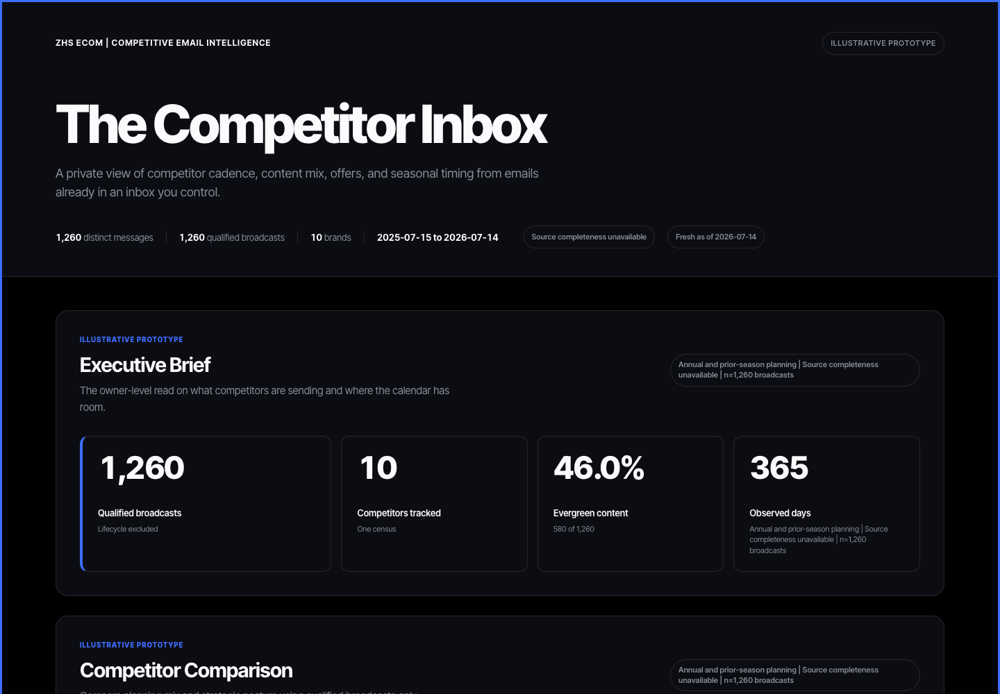

# The Competitor Inbox

Turn marketing emails already delivered to an inbox you control into a private
strategy dashboard for your direct competitors.

You choose the brands. The dashboard turns their observed sends into an
owner-level view of cadence, messaging mix, offers, and seasonal timing. Every
section carries its message count, date window, and coverage status so the
evidence stays attached to the conclusion.

The source is your inbox. This project does not harvest competitor email
addresses, automate subscriptions, or claim that an observed email performed.



## What the dashboard shows

- Executive Brief: the observed archive, qualified broadcast count, date
  range, source coverage, and the strongest evidence-backed findings.
- Competitor Comparison: send volume, cadence, offer use, seasonal share,
  content mix, and posture for each tracked brand.
- Evergreen and Promotional Engine: the angles competitors keep in rotation
  and the promotions they use outside seasonal windows.
- Seasonal Planner: explicit retail occasions and the periods where tracked
  brands concentrate their sends.
- Messaging Library: sanitized subjects, preheaders, and metadata, separated
  into broadcast, lifecycle, and uncertain scopes.
- Owner-level Action Plan: practical 30, 60, and 90-day review steps based on
  the available history.
- Coverage and Methodology: the source limits, denominators, classification
  rules, and evidence behind each view.

Lifecycle messages remain available for research but stay outside broadcast
strategy metrics. Numeric offer depths require deterministic text evidence.

## Run the synthetic demo

The credential-free demo creates 1,260 synthetic emails from 10 fictional
competitors over 365 days. Northstar Apparel is the fictional owner account,
and every demo surface is stamped `ILLUSTRATIVE PROTOTYPE`.

Install the package in a virtual environment:

```bash
git clone https://github.com/ZachSchieffer/competitor-inbox.git
cd competitor-inbox
python3 -m venv ../competitor-inbox-venv
../competitor-inbox-venv/bin/python -m pip install .
```

Build, verify, and open the demo:

```bash
../competitor-inbox-venv/bin/python -m competitor_inbox demo
../competitor-inbox-venv/bin/python -m competitor_inbox verify
../competitor-inbox-venv/bin/python -m competitor_inbox open
```

No inbox credentials are collected. The demo package is written to
`~/competitor-inbox-data/demo/` by default.

Public documentation uses synthetic demo output only. Real census captures,
message data, and production dashboards stay outside this repository.

## Connect your inbox

Follow [START-HERE.md](START-HERE.md) for the complete installation and setup
path. It covers:

1. System requirements and the local virtual environment.
2. Gmail app-password setup through a hidden macOS Keychain prompt.
3. The local mbox route when app passwords are unavailable.
4. The 12-month backfill and Early Data Gate.
5. Dashboard generation, verification, and daily local updates.
6. Privacy checks before any repository change is published.

The production dashboard is generated at:

```text
~/competitor-inbox-data/outputs/dashboard.html
```

The scheduled job runs at 7:00 AM local time and uses a 14-day overlap. The
Mac must be on or wake for that update to run.

## Privacy boundary

- The public repository contains code, documentation, tests, and deterministic
  synthetic data only.
- Production mail, normalized records, state, AI cache, logs, and dashboard
  output live under `~/competitor-inbox-data/` by default, outside Git.
- Gmail access uses read-only `EXAMINE`, UID operations, and `BODY.PEEK[]` over
  TLS. A local mbox export is also supported.
- Gmail app passwords enter through a hidden prompt and are stored in macOS
  Keychain. They never belong in configuration, shell history, logs, or Git.
- Recipient addresses, personalized tokens, and tracking parameters are
  stripped before records reach analysis or dashboard output.
- Email HTML is parsed as data. The app does not execute it, fetch remote
  images, or fire tracking pixels.
- The generated dashboard is static HTML with a restrictive Content Security
  Policy, no runtime JavaScript, and no external resources.
- Optional AI classification sends sanitized subject, preheader, and visible
  text to Anthropic. Addresses, HTML, IDs, URLs, attachments, and tracking
  parameters stay local.

Run the repository audit before a push:

```bash
../competitor-inbox-venv/bin/python -m competitor_inbox privacy-check
python3 scripts/privacy_audit.py --repo .
```

## What the evidence can support

The dashboard describes competitor behavior observed by your inbox. It can
show what arrived, when it arrived, and how the message was framed.

It cannot prove opens, clicks, conversions, revenue, profitability, or why a
competitor made a decision. Use the dashboard to plan research and messaging,
then validate those decisions against your own economics and customer data.

Coverage also depends on the archive you provide. A new inbox starts with a
short current-activity view and becomes more useful as history accumulates. An
existing mbox export can supply prior history when its receipt dates are
trustworthy.

## Known limits

- Gmail app passwords provide broad mailbox access, so a dedicated research
  inbox is the safer operating choice.
- Google Workspace policy can disable app passwords.
- Lifecycle and intent classification involve judgment and can be wrong.
- Optional AI processing sends sanitized text to Anthropic.
- Local scheduled updates depend on the Mac being on or waking.
- Inbox history shows competitor behavior, not competitor performance.

Detailed commands, setup checks, scheduling behavior, and recovery steps live
in [START-HERE.md](START-HERE.md).
